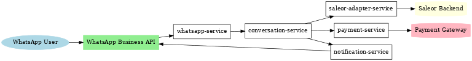
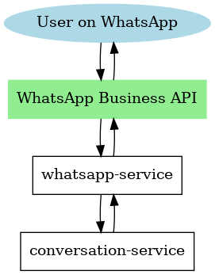
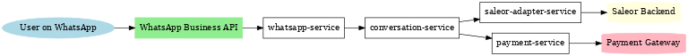
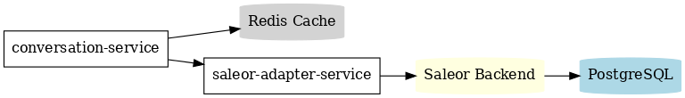

# eco-wa-service


\# WhatsApp E-Commerce Platform (Java Spring Boot + Saleor)


\## Overview
# Multi-Service E-Commerce Integration Platform

This project implements a **microservices-based architecture** for integrating **WhatsApp Business API**, **Saleor E-Commerce**, **Payment Gateway**, and **Notification System**.  
It is designed for **scalability**, **extensibility**, and **cloud deployment** (tested with [Render](https://render.com)).

---

## 📌 High-Level Architecture



The architecture consists of several microservices communicating over HTTP (REST) and messaging (RabbitMQ).  
Key components:
- **WhatsApp Service** — Handles incoming/outgoing messages via WhatsApp Business API.
- **Conversation Service** — Manages chatbot logic and order conversation flows.
- **Saleor Adapter Service** — Integrates with Saleor GraphQL API for product, order, and customer management.
- **Payment Service** — Manages payment requests and status updates.
- **Notification Service** — Sends transactional notifications via various channels (e.g., email, push).
- **Redis** — Caching layer.
- **PostgreSQL** — Central database for persistent data.

---

## 📜 Service Overviews

### 1. **WhatsApp Service**
- Receives webhooks from Meta’s WhatsApp API.
- Validates webhook tokens.
- Sends and receives messages.
- Passes conversation context to the Conversation Service.


---

### 2. **Conversation Service**
- Orchestrates chat flows.
- Calls Saleor Adapter for product/order details.
- Manages session data in Redis.



---

### 3. **Saleor Adapter Service**
- Connects to Saleor's GraphQL API.
- Retrieves product catalog, stock status, and order history.
- Creates new orders when confirmed by the Conversation Service.



---

### 4. **Payment Service**
- Creates payment links.
- Handles payment gateway callbacks.
- Updates Saleor when payment is confirmed.


---

### 5. **Notification Service**
- Sends confirmation messages (email, push, WhatsApp).
- Alerts users about shipping, delivery, or payment status.


---

### 6. **Data & Caching Layer**
- **PostgreSQL**: Persistent storage for order and transaction data.
- **Redis**: Used for caching frequently accessed data and conversation states.



---

## 🚀 Deployment

### Local Development
1. Clone the repository:
   ```bash
   git clone https://github.com/your-org/microservices-ecommerce.git
   cd microservices-ecommerce


### Start services with Docker Compose

2. Clone the repository (if you haven't already):
   ```bash
   git clone https://github.com/your-org/microservices-ecommerce.git
   cd microservices-ecommerce

3. Build and bring up all services:

# Build images and start containers in the foreground
docker-compose up --build

# Or run in the background (detached)
docker-compose up --build -d


Verify services are running (example local ports):

WhatsApp Service → http://localhost:8080

Conversation Service → http://localhost:8081

Saleor Adapter Service → http://localhost:8082

Payment Service → http://localhost:8083

Notification Service → http://localhost:8084

Configure environment variables
You can define these either in:

docker-compose.yml → environment: section

A .env file in the project root (Docker Compose will auto-load it)

Required variables:


DATABASE_URL=jdbc:postgresql://localhost:5432/saleor_pnou
DATABASE_USERNAME=saleor
DATABASE_PASSWORD=yourpassword
WH_VERIFY_TOKEN=your_verify_token
WHATSAPP_API_TOKEN=EAA...
REDIS_HOST=redis
REDIS_PORT=6379
PAYMENT_GATEWAY_KEY=...


View logs and service health

All logs (foreground run): printed directly in terminal

Specific service logs:


View logs and service health

All logs (foreground run): printed directly in terminal

Specific service logs:

Health checks:

If using Spring Boot Actuator: /actuator/health

Or a custom /health endpoint

Common troubleshooting

Port conflicts → Stop processes using that port (lsof -i :8080) or update docker-compose.yml ports

Database errors → Ensure Postgres container is up and healthy:

docker-compose ps
docker-compose logs postgres

Missing environment variables → Verify .env file or docker-compose.yml has all required vars


Stop and clean up

# Stop services
docker-compose down

# Stop and remove volumes (⚠ deletes all local data)
docker-compose down -v
